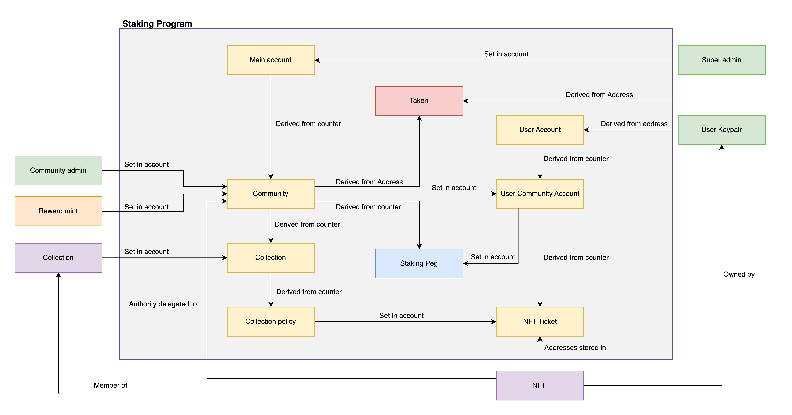

# Emerald

Emerald is Open-Source Reward Infrastructure that allows 'Token Communities' to distribute rewards based on NFT Collections and Assets. It is analogue to 'Staking' experiences you may already be familiar with. Emerald is Non-Custodial and in-Active Development with new features being contributed by 21 12 Labs.

## Running Emerald Locally 💻

Running with solana-cli = `solana-cli 1.14.18 (src:b00d18ce; feat:1879391783)`

`solana-install init 1.14.18`

`avm use 0.27.0`

*Tests will deploy metaplex collections.*

**👨🏽‍💻 to test locally:**

- change to node 16 with `nvm use 16`
- `yarn`
- `yarn start-validator`
- `anchor build`
- `anchor deploy`
- `anchor run test`

If validator sticks around longer than desired `kill -9 $(lsof -t -i:9900)`.

*There is an active-effort to organise and make this entire process easier.*

## Handling Duplicate Accounts - Community Account Dupe Prevention

When deploying (creating) a user community account another PDA (`taken`) gets created with the following seeds:

    seeds = [
        MAIN_SEED.as_bytes(),
        &user.key().as_ref(),
        &community_pool.key().as_ref()
        ],

Should a user try to create a new community account, that maps to the same community the program will reject it as that account will exist already.

## Handling Snapshots

When user community account is being created, a new PDA (`snapshot_peg`) is added based of counter of the community account. This PDA chai can be iterated over, and within each PDA is a pointer to the user community account address, which can be fetched to check how many NFTs (if any) are being staked by that user under that community.

    seeds = [
        SNAPSHOT_PEG_SEED.as_bytes(),
        &community_pool.key().as_ref(),
        &community_pool.total_users.to_be_bytes(),
        ],

This account lasts forever once created and to prevent counter spiraling out of control, there is a a small fee for creating user community account.

## Flow(with references to PDAs):

We need to initliasie_main first setting up initial fees structrue. There is a function to later update this fee as well.

Each user has to have a general account created as well as an specific account for each of the communites.
'General' User Account is derived from address of User's Keypair.
User Community Account is derived from counter of User Account (index which is incremented everytime users joins new community)

Community is derived from counter of Main Account (again index which is incremented everytime new community is creatd). One community can have multiple collections.
Collection is derived from counter of Community Account (again index which is incremented everytime new collection is created).

### License & Attribution

<a property="dct:title" rel="cc:attributionURL" href="https://github.com/2112-Foundation/Emerald">Emerald Program</a> by <a rel="cc:attributionURL dct:creator" property="cc:attributionName" href="https://2112.dev">21 12 Labs</a> is licensed under <a href="http://creativecommons.org/licenses/by-nc/4.0/?ref=chooser-v1" target="_blank" rel="license noopener noreferrer" style="display:inline-block;">Attribution-NonCommercial 4.0 International</a>

## PDA Layout

